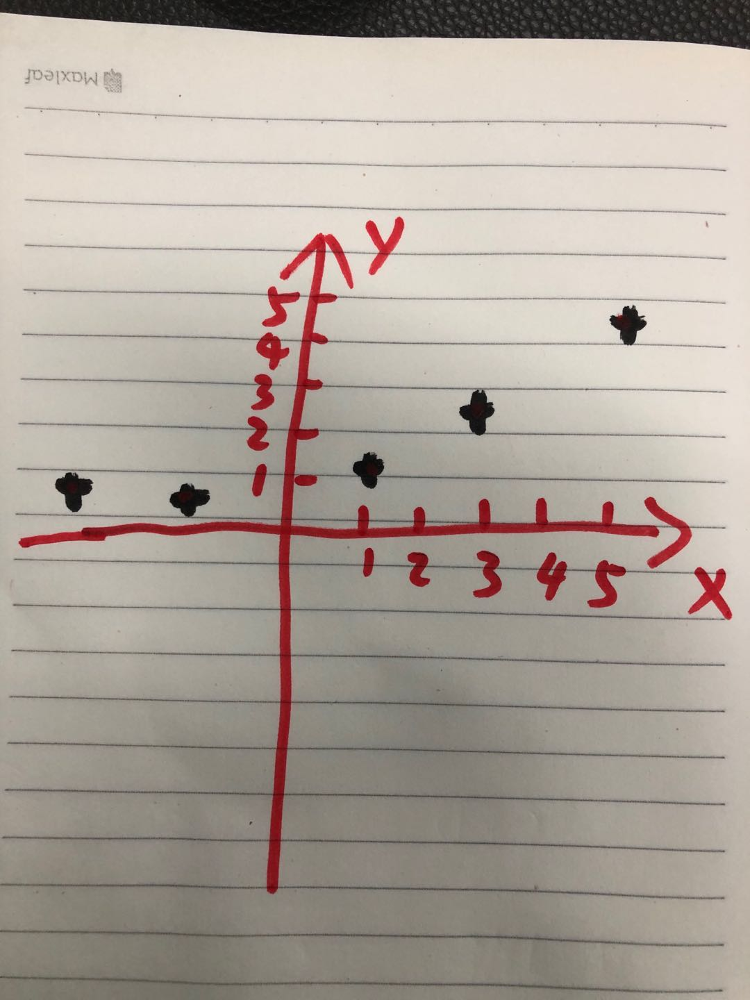

# L33 曲线拟合

## 课程引入
可能很多同学都不理解什么叫做拟合。
大家可以先把这个概念放在一边，我们先来做个游戏。请大家拿出一张纸来。

我们来花一些图。首先请大家在纸上：
1. 画一个坐标轴(横轴和纵轴)，标上x,y;
2. 再标上刻度：1，2，3，4或者10，20，30，40，都可以；
3. 在图中标一些点。
昨晚上面三步，类似于下图的样子：


然后我们做游戏的内容，现在大家用尽可能顺滑的线将这些点连接在一起，要求只有一个：线不能有交叉。大家画一下试试看。看看可否让自己的线条看上去更顺滑一些？
画好后，请大家分享给同学们看看。

划线的过程，其实就叫做“拟合”。拟合的标准定义是：曲线拟合（fit theory），俗称拉曲线，是一种把现有数据透过数学方法来代入一条数式的表示方式。

上面这个定义依然可能让同学们无法理解。那用通俗的方式解释一下。
在一些情况下，我们只知道一些数据点，但不知道这些点之间的规律，通过用尽可能平滑的曲线把这些点连接起来，然后计算这条曲线对应的函数，就可以找到这些点的规律了。
让老师说的更直白一些：
我们前两节课，都是首先定义一个方程式（函数），然后定义一个x值（变量）的范围，对应的，就可以得到一组y值。通过工具，我们可以将x值和y值画出来，就可以观察到方程式（函数）的曲线。
拟合和这个过程刚好相反。它的目的是首先有一组值，根据这组值来推断一个曲线，并进一步推断出可能的方程式（函数）。这个步骤分开来写可以这样描述：
1. 已知一些点的位置（例如我们在坐标轴上标记的点）；
2. 将这些点用曲线连接起来，并使其尽可能顺滑；
3. 根据曲线，计算这条曲线对应的方程，让所有的已知点都符合这个方程的描述。

这在数学和工程上是非常有用的技能，以前，这要经过大量的绘图和计算，现在我们如果会用python的话，可以很容易的画出图形并计算出方程。
今天的课程，我们就来学习如何做“曲线拟合”。

## 准备数据
按照上面说的，我们需要先准备一个坐标轴，在准备一些点。通过上两节课的学习，这自然难不住大家：
只有一个技能是需要提前给大家讲的，画点：
```python
plt.scatter(x0, y0, 25, "red")
```
使用plt.scatter可以绘制一系列的点。例子中的参数：点的横坐标存储在x0，纵坐标存储在y0，点的大小为25，颜色为'red'。
有了这个知识，我们可以设定一些点，先画出一个点图：
```python
import matplotlib.pyplot as plt

plt.figure()
#拟合点
x0 = [1, 2, 3, 4, 5]
y0 = [1, 3, 8, 18, 36]
#绘制散点
plt.scatter(x0, y0, 25, "red")

plt.title("fit theory")
plt.xlabel('x')
plt.ylabel('y')
plt.show()
```

## 直线拟合
拟合曲线最重要的函数是：optimize.curve_fit()函数。
这需要我们首先安装一个重要的组件：scipy；
```bash
# 中国大陆地区
# 电脑上只有python3时
pip install -i https://pypi.tuna.tsinghua.edu.cn/simple scipy
# 电脑上有python3和python3时
pip3 install -i https://pypi.tuna.tsinghua.edu.cn/simple scipy
# 其它地区
# 电脑上只有python3时
pip install -i scipy
# 电脑上有python3和python3时
pip3 install -i scipy
```
我们看看这个函数的用法

```python
import matplotlib.pyplot as plt
import numpy as np
from scipy import optimize

#直线方程函数
def f_1(x, A, B):
    return A*x + B


#拟合点
x0 = [1, 2, 3, 4, 5]
y0 = [1, 3, 8, 18, 36]

plt.figure()
#绘制散点
plt.scatter(x0, y0, 25, "red")


#直线拟合与绘制
A1, B1 = optimize.curve_fit(f_1, x0, y0)[0]
x1 = np.arange(0, 6, 0.01)
y1 = A1*x1 + B1
plt.plot(x1, y1, color='b')

plt.title("fit theory")
plt.xlabel('x')
plt.ylabel('y')

plt.show()
```
我们先看看效果，一条直线画出来了，穿过了一些点，距离一些点很近。
有些学过的同学应该知道。我们定义了一个简单的函数：
A * x + B
这个函数称为一次函数，一次函数的图像一定是一条直线。
直线当然不能完美的穿过所有的点，但是大家能看出来，这条直线应该是**距离所有点最近**的一条直线。

我们还可以用上节课学过的图例吧函数显示出来：
```python
...
y1str = ('%sx+%s' % (A1,B1))
plt.plot(x1, y1, color='b', label=y1str)
...
plt.legend()
plt.show()
```
但是，我们可以观察到这个函数是：
8.500000000016357x+-12.300000000029005
这样看上去显然不太对劲。我们来美化一下：这里给大家简要的讲一下string.format。
我们之前调整格式用的是这种方式：
```python
a = 'Score'
b = 12.321
print('%s : %s' % (a, b))
#Score : 12.321
```
string.format是python中功能更强大的修正格式的方式，同样的功能可以写成：

```python
a = 'Score'
b = 12.321
print('{}:{:.2f}'.format(a, b))
#Score:12.32
```
使用format可以更加灵活的对数据进行处理，大家看到了，显示规则写在{}中，大家请参看这里的内容：
https://www.runoob.com/python/att-string-format.html

其中这四个规则是数字格式最常用的，列在这里：

| 范例       | 格式    | 输出      | 描述                   |
| ---------- | ------- | --------- | ---------------------- |
| 3.14159265 | {:.2f}  | 3.14      | 保留小数后两位         |
| 3.14159265 | {:+.2f} | +3.14     | 带符号保留小数点后两位 |
| 1000000    | {:,}    | 1,000,000 | 以逗号分隔的数字格式   |
| 0.25       | {:.2%}  | 25.00%    | 百分比格式             |

有了这些知识，我们可以重新写函数表达式：
```python
#y1str = ('%sx+%s' % (A1,B1))
y1str = '{:.2f}x {:+.2f}'.format(A1,B1)
```
对应的函数表达式成了：8.50x-12.30。这下舒服多了。

还有一点要和同学们讲一下，有些细心的同学应该发现了，我们下面的写法：
```python
A1, B1 = optimize.curve_fit(f_1, x0, y0)[0]
```
意味着，curve_fit函数返回的是一个数组，而我们只使用了数组的第一个返回值（这个返回值也是个数组）。
这里和大家简单说一下，curve_fit的确返回的是一个数组，其中第一个返回值提供了计算出来的函数，也就是我们希望得到的A1，B1。curve_fit返回的第二个值也是个数组，这个数组是用来检验第一个值的，但是因为检验的过程已经超过的大部分人的数学知识储备。我们在这里不讲。因此大家记得，使用curve_fit时，一定记得加上角标`[0]`以避免错误。


## 二次曲线拟合
为了穿过更多的点，让我们的“拟合”更完美，我们看看二次曲线，就是类似于 A * x*x + B * x + C 这样的函数。如果同学们学过，就应该知道二次函数的图像是条曲线。在上面的代码中增加如下的代码：
首先定义一个二次函数方程，然后让optimize.curve_fit来计算一下A,B,C的值：
```python
...
#二次曲线方程
def f_2(x, A, B, C):
    return A*x*x + B*x + C
...
#二次曲线拟合与绘制
A2, B2, C2 = optimize.curve_fit(f_2, x0, y0)[0]
x2 = np.arange(0, 6, 0.01)
y2 = A2*x2*x2 + B2*x2 + C2 
plt.plot(x2, y2, color='g')
```
我们看看曲线的效果，看上去不错！绿色曲线接近贯穿所有的点了。
现在我们需要吧这个曲线的表达式写在图例里面。大家试试看？

【学生练习】（五分钟时间） 参照y1str的表达式，写出y2str。X平方大家可以写成x*x，也可以写成xx，这个并不重要。另外别忘了在plot中加入label参数。
如果学生完成困难，请老师提示一下结构： y2str = '  '.format(A2,B2,C2)
【参考实现】老师这样写：
```python
y2str = '{:.2f}x*x {:+.2f}x {:+.2f}'.format(A2,B2,C2)
plt.plot(x2, y2, color='g',label=y2str)
```

## 作业
大家看到了二次曲线可以更好的接近所有的点，但是我们还没有完全吧所有的点都完美的穿过。怎样才能做的更好呢？请大家想象一下？
【学生讨论】如何更精准的贯穿所有点？
使用更多的参数，可以制作出更复杂的曲线，使用三次曲线的确可以做到更好的贯穿这些点。老师给大家演示一下fit.theory3.py。看看三次曲线的效果。
大家看，三次曲线的确完美的穿过了所有的点，显然，更复杂的函数，更能准确的表达这些点代表的规律。

如何用代码实现三次曲线呢？这就是今天的作业。请大家在现有代码基础上完成。老师将fit.theory2.py的代码发给大家供参考。


